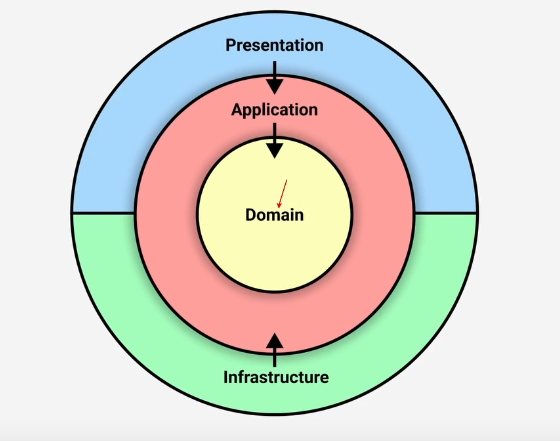

# TicTacToe Domain Layer using Domain Driven Design in Typescript

This is an implementation with typescript of the Domain Layer of the popular game of TicTacToe (aka OXO) using Domain Driven Design.

## 1. Clean Architecture typical representation

In this project we will only focus on the domain layer, the inner layer of the clean architecture

## 2. Domain Representation

We have two bounded contexts: TicTacToe Game and our user's system.

Is the TicTacToe context where our game will be implemented, and in the user's contexts, we will implement actions of login

