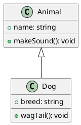

# TicTacToe Domain Layer using Domain Driven Design in Typescript

This is an implementation with typescript of the Domain Layer of the popular game of TicTacToe (aka OXO) using Domain Driven Design.

